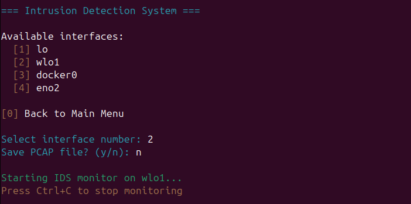
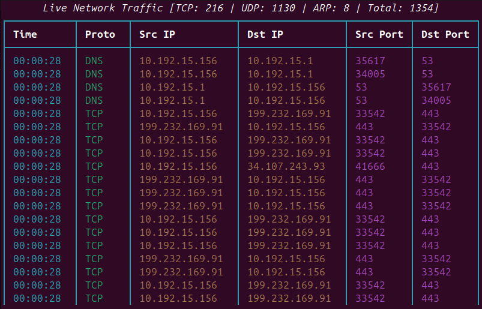
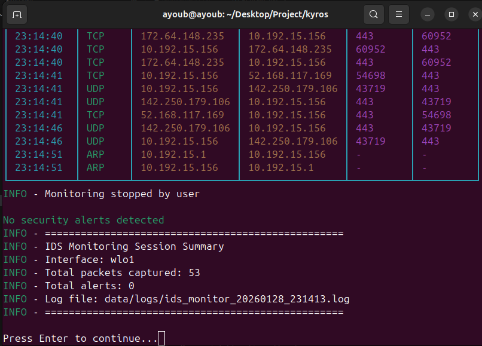
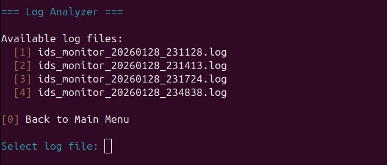
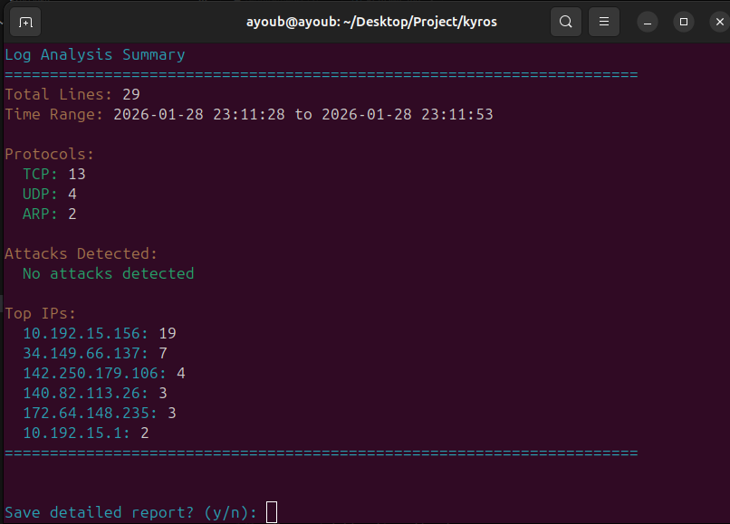
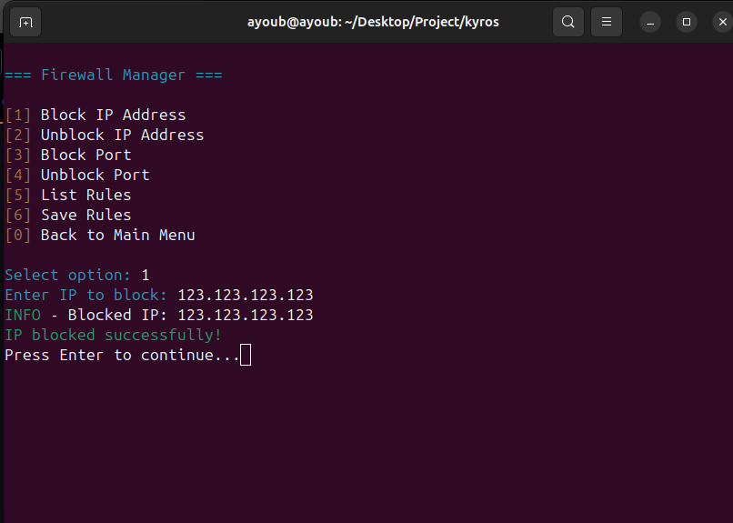

# 🛡️ Kyros - Professional Security Toolkit


**Kyros** is a comprehensive command-line security toolkit designed for network defense and security monitoring. It combines intrusion detection, log analysis, and firewall management into a unified interactive interface.

The tool is suitable for:
* Security professionals and network defenders
* Network administrators managing infrastructure security
* Cybersecurity students learning defensive techniques
* SOC analysts performing threat detection and analysis

---

## 📋 Table of Contents

- [✨ Key Features](#-key-features)
- [🚀 Installation](#-installation)
- [🎮 Usage](#-usage)
- [📊 Modules](#-modules)
- [🔐 Security Notes](#-security-notes)
- [📜 License](#-license)

---

## ✨ Key Features

### 🚨 Intrusion Detection System (IDS)
* Real-time packet capture and analysis using **Scapy**
* Attack detection: SYN floods, UDP floods, ICMP floods, port scans
* ARP spoofing and DNS spoofing detection
* Live traffic monitoring with rich terminal UI
* Optional PCAP file export for further analysis

### 📊 Log Analyzer
* Parse and analyze IDS log files
* Protocol distribution and traffic statistics
* Attack pattern identification and anomaly detection
* Automatic report generation with suspicious IP tracking
* Export results in text format for documentation

### 🔥 Firewall Manager
* **iptables** rule management interface
* Block/unblock IP addresses and ports
* List active firewall rules
* Persistent rule saving
* Confirmation prompts for dangerous operations

### 🖥️ User Experience
* Interactive menu-driven interface
* Beautiful ASCII art banner and colorized output
* Root privilege management with helpful prompts
* Clean terminal UI powered by **Rich** and **Colorama**

---

## 🚀 Installation

### Prerequisites
* Python **3.8 or higher**
* Linux operating system (tested on Ubuntu/Debian)
* Root/sudo access for network operations
* System tool: `iptables`

### Setup

```bash
# Clone the repository
git clone https://github.com/yourusername/kyros.git
cd kyros

# Install system dependencies
sudo apt update
sudo apt install -y iptables python3-pip python3-venv

# Create virtual environment
python3 -m venv venv

# Activate the environment
source venv/bin/activate

# Install Python dependencies
pip install -r requirements.txt
```

### Verify Installation

```bash
# Test without root (will show a warning but menu should appear)
python3 kyros.py
```

If you see the Kyros banner and main menu, the installation is successful!

**Note:** Keep the virtual environment activated when running Kyros, or use the venv's Python directly with `sudo venv/bin/python3 kyros.py`

---

## 🎮 Usage

### Quick Start

**If using virtual environment (recommended):**

```bash
# Activate the virtual environment first
source venv/bin/activate

# Run with venv's Python and sudo
sudo venv/bin/python3 kyros.py

# Or as a module
sudo venv/bin/python3 -m kyros
```

**Alternative methods:**

```bash
# Using the startup script (automatically installs dependencies system-wide)
sudo ./start.sh

# Or with system Python (requires dependencies installed system-wide)
sudo python3 kyros.py
```

### Interactive Menu

Once launched, Kyros presents an interactive menu:


Navigate using number keys and follow the interactive prompts.

---

## 📊 Modules

### 1. Intrusion Detection System

Monitor network traffic for suspicious activity:

**Features:**
* Real-time packet capture and analysis
* Detection of common attack patterns
* Live statistics dashboard
* Optional PCAP export

**Interface Selection:**



**Live Monitoring:**



**Session Summary:**



Logs are saved in `data/logs/` and PCAP files (if enabled) are stored in the data directory.

### 2. Log Analyzer

Analyze captured IDS logs for patterns and threats:

**Features:**
* Parse log files and extract metrics
* Identify suspicious IP addresses
* Generate attack summaries
* Export detailed reports

**Log File Selection:**



**Analysis Summary:**



### 3. Firewall Manager

Manage iptables firewall rules:

**Features:**
* Block/unblock IP addresses
* Block/unblock specific ports
* List current firewall rules
* Save rules persistently

**Screenshot:**



**Note:** Requires root privileges and prompts for confirmation on dangerous operations.

---

## 🔐 Security Notes

* **Root Privileges Required**: Kyros needs root access for packet capture and firewall management
* **Defensive Use Only**: This tool is designed for defensive security and authorized monitoring only
* **Legal Compliance**: Only monitor networks you own or have explicit permission to monitor
* **Network Impact**: Packet capture may affect network performance on high-traffic interfaces
* **Data Storage**: All logs and reports are stored locally in the `data/` directory
* **Configuration**: Adjust detection thresholds in `config/default_config.yaml` as needed

### Ethical Usage

Kyros is intended for:
* Network security monitoring of owned infrastructure
* Educational purposes in controlled lab environments
* Security incident response and forensics
* Defensive security operations

Unauthorized network monitoring may be illegal in your jurisdiction.

---

## 📜 License

This project is licensed under the **MIT License**.

**Author:** Ayoub Serarfi
